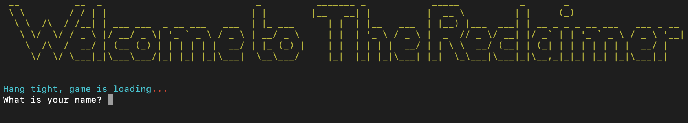
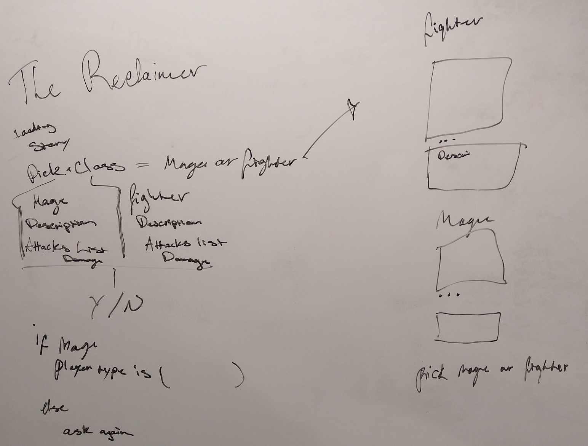
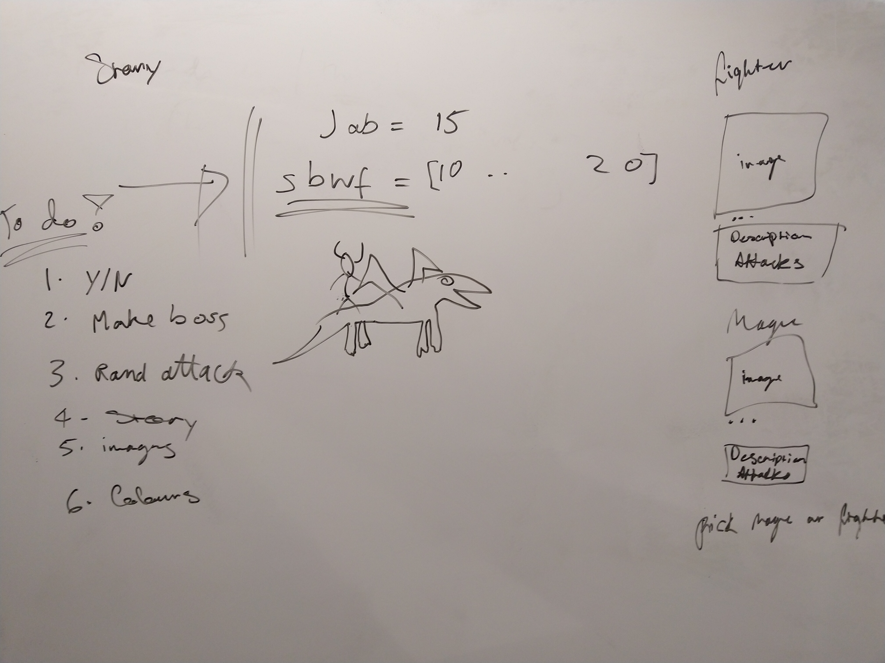
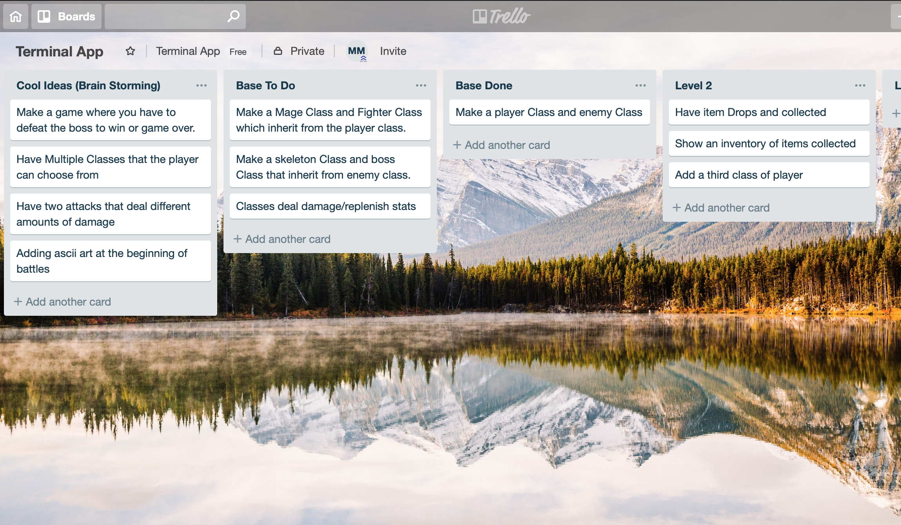
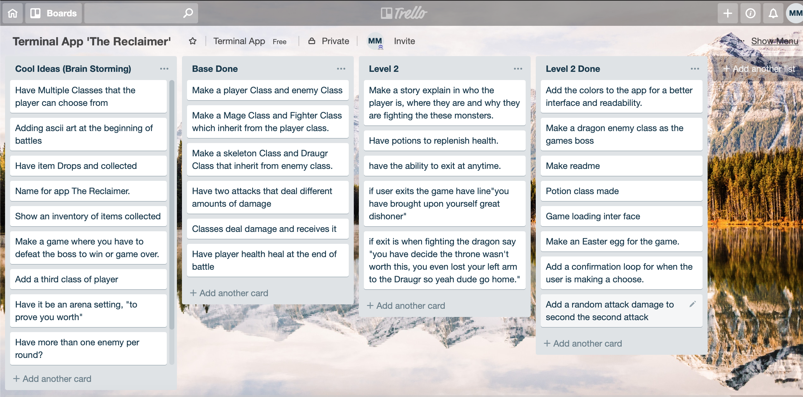
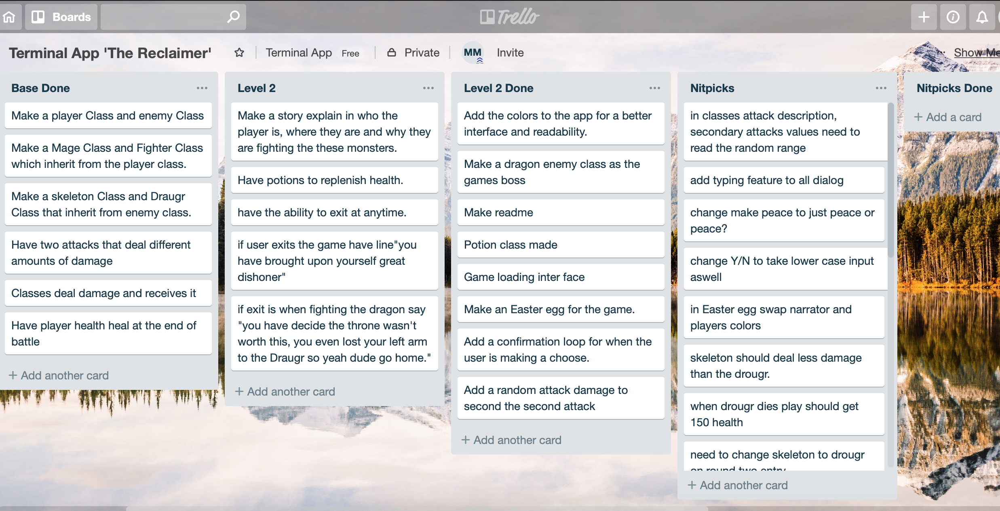
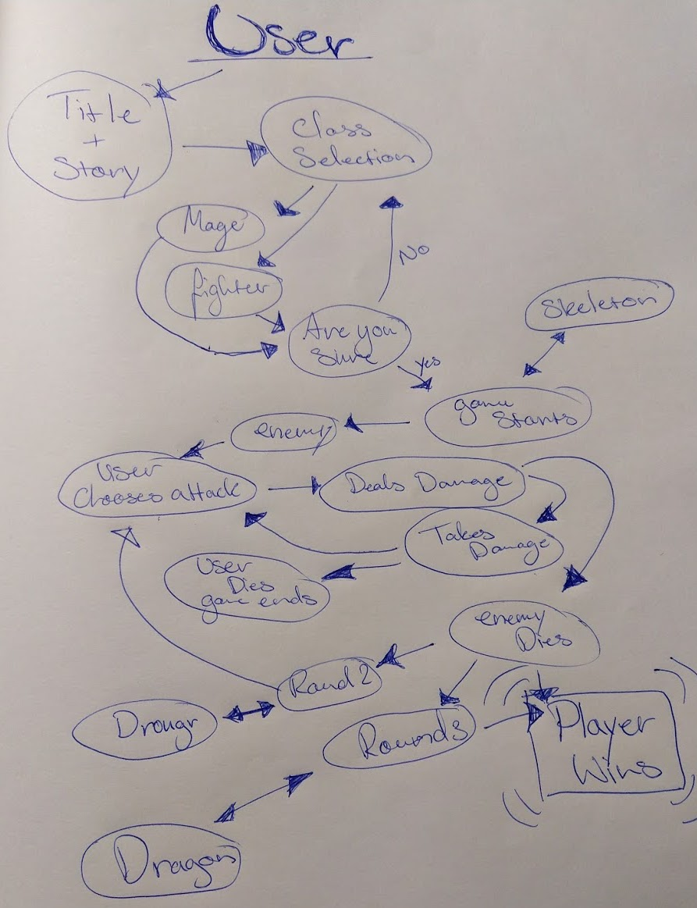

# Terminal_App "The Reclaimer"

This application is a game, were you can choose a class, and deal damage to monsters with an engaging story. It is run in the Bash command line written in ruby.

## Contributors

| | |
|-----------|-----------|
| Jovan Nikolic | Melissa McAdam |


### Link

https://github.com/Bot81892/terminal_app

### Purpose

Made for gamers that want a fun way to spend time and love a simplified old school style game. The Reclaimer made to emerge the user within it's world through the story, fun art and the challenges they must face, the goal is for the player to overcome enemies and find intrigue with the story line, resulting in a fun experience.

### Functionality

 At the beginning, the user will be introduced into The Reclaimers world. The game will prompt the user to input a name and then choose a character class to play the game as.
 
 Based on user inputs, The Reclaimer will return a class selection, enter the arena and attack the enemy with the choice of two attacks, there is also the option to exit and if you look for it a easter egg.

### Instructions for use

Open a Terminal or preferred console.
To initialise program, enter:

Gem install
```terminal
'artii'
'colorize'
```

To initialise program, enter:

```terminal
$ ruby terminal_app.rb
```

Ready to go!

 
<!--Hope to add a beter screen shot including finalized intro story once we agree on it-->


## Design & Planing

Initially we did most of our brainstorming through slack, due to logistics. We quickly decided to build a game for our terminal application and went on to discuss different possibilities and limitations that we may encounter, as well as our time restraints.
Our main priority, was providing an engaging experience for the user.

 


 
<!--If you have any stuff for brain storming slack it to me I'll add it in-->

<!--I hope to add a picture of some writern brain storming, probablly be a scrible of our first ideas.-->

 


### Task Management

We used Trello to plan and keep track of different elements we had planed to use in our code. Trello allowed us to breakdown tasks to be performed and arrange new ideas as we built our minimum viable product.

 
 
 

### User Journey/Workflow
 

### Project Plan & Timeline
For The Reclaimer's initial build, we had two days to code the minimum viable product and another two days make changes before submission. Our first step was to decide on what ideas we want to use and which were possible within the MVP.

Day 1: 

As we had already discussed and brain stormed some ideas, we could dive straight into designing and building our MVP. On the first day we were focused on creating a solid plan for what we knew we could achieve and what we eventually wanted to have in the final version. As we started to code, we soon completed the player and character classes, mage and fighter with two attacks each, a enemy class and one enemy object with its own attack. By the end of the day we had a loop for the battles, two enemies and all characters with their own name, attacks, attack damage and health value.

Day 2: 

On the second day we completed multiple methods and a MVP, soon we were thinking of new ideas for user interactions and a visual display to break apart the main body of text that was our game. With the MVP complete we started adding some of our other ideas, a third enemy, possibly using a heal function and a hidden easter egg. We also implemented a sleep count, a character each loop and gems, artii as well as colorize, to make the code easier to read.

Day3 & day 4:

The last two days before submission, involved finalizing and testing the code, finding little issues for example the wrong name being displayed or little additions and changes to the narrative, for users to enjoy.

##User Stories
